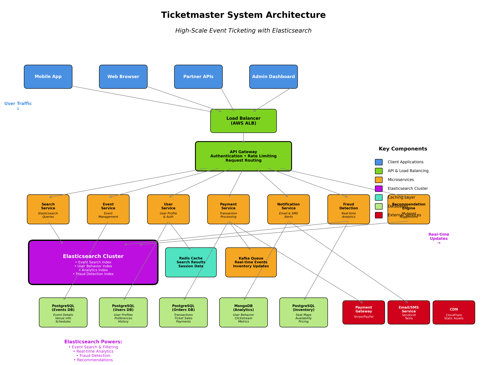

# Ticketmaster System Design Implementation

A complete Elasticsearch-powered ticketing platform implementation with fraud detection, real-time search, and analytics capabilities.

## 🚀 Quick Start

1. **Start the services**: `docker compose up -d`
2. **Set up environment**: `python setup/setup_experiment.py`
3. **Load sample data**: `python setup/ingest_sample_data.py`
4. **Run experiments**: `python experiments.py --experiment search`

## 📁 Organized File Structure

```
ticket_master/
├── 📁 src/                          # Core implementation
│   ├── search_service.py           # Main search engine with caching
│   ├── elasticsearch_mappings.py   # Index schemas and configurations
│   └── fraud_detection.py          # Real-time fraud detection system
├── 📁 setup/                       # Setup and data tools
│   ├── setup_experiment.py         # Initialize Elasticsearch indices
│   ├── ingest_sample_data.py       # Load sample events and users
│   └── setup_venv.sh               # Python environment setup
├── 📁 docs/                        # Documentation
│   └── SETUP_GUIDE.md              # Detailed setup walkthrough
├── 📁 tests/                       # Test files (for future expansion)
├── experiments.py                  # Interactive learning demos
├── ticketmaster_architecture.py    # Architecture diagram generator
├── docker-compose.yml              # Local development cluster
├── requirements.txt                # Python dependencies
└── README.md                       # This file
```

| Component                       | Purpose                        | How to Use                                  |
| ------------------------------- | ------------------------------ | ------------------------------------------- |
| **Core Services**               |                                |                                             |
| `src/search_service.py`         | Production-ready search API    | Import and use search methods               |
| `src/elasticsearch_mappings.py` | Index design patterns          | Study mapping configurations                |
| `src/fraud_detection.py`        | Security & anti-bot protection | Integrate risk assessment                   |
| **Quick Start**                 |                                |                                             |
| `setup/setup_experiment.py`     | Initialize system              | `python setup/setup_experiment.py`          |
| `setup/ingest_sample_data.py`   | Load test data                 | `python setup/ingest_sample_data.py`        |
| `experiments.py`                | Interactive demos              | `python experiments.py --experiment search` |
| **Infrastructure**              |                                |                                             |
| `docker-compose.yml`            | Local development              | `docker compose up -d`                      |
| `docs/SETUP_GUIDE.md`           | Comprehensive guide            | Follow step-by-step instructions            |

## 🏗️ System Architecture

This implementation demonstrates a scalable ticketing platform with:

- **Elasticsearch** for sub-second search across millions of events
- **Redis** for caching and session management
- **Real-time fraud detection** using behavioral analytics
- **Geo-location search** for venue-based queries
- **Auto-complete** suggestions for better UX
- **Analytics pipeline** for business intelligence



*Note: This document links directly to relevant areas found in the [system design topics](https://github.com/donnemartin/system-design-primer#index-of-system-design-topics) to avoid duplication. Refer to the linked content for general talking points, tradeoffs, and alternatives.*

**Design StubHub**, **Design Eventbrite**, and **Design SeatGeek** are similar questions.

## 🎯 What You'll Learn

This implementation covers:

- **Full-text search** with relevance scoring and filters
- **Geo-location queries** for venue-based search
- **Real-time analytics** using Elasticsearch aggregations
- **Fraud detection** with behavioral pattern analysis
- **Auto-complete** and suggestion systems
- **Performance optimization** for high-traffic scenarios
- **Docker deployment** with multi-service orchestration

## 🛠️ Core Components Explained

### `search_service.py` - The Heart of the System
```python
# Main search functionality
search_events(query="Taylor Swift", location=(40.7128, -74.0060))
get_recommendations(user_id="user123")
autocomplete_suggestions(prefix="taylor")
```

### `fraud_detection.py` - Security & Anti-Bot Protection
```python
# Detect suspicious behavior
assess_fraud_risk(session_id, user_actions)
detect_bot_patterns(ip_address, user_agent)
```

### `experiments.py` - Interactive Learning
Available experiments:
- `search` - Basic and advanced search patterns
- `facets` - Category, price, and location filters
- `geo` - Distance-based venue search
- `autocomplete` - Type-ahead suggestions
- `fraud` - Suspicious activity detection
- `analytics` - User behavior analysis

## 📊 Sample Queries You Can Run

### 1. Find Taylor Swift concerts near NYC under $200
```bash
python experiments.py --experiment search
```

### 2. Detect high-risk purchasing patterns
```bash
python experiments.py --experiment fraud
```

### 3. Analyze popular search terms and conversion rates
```bash
python experiments.py --experiment analytics
```

## Step 1: Outline use cases and constraints

> Gather requirements and scope the problem.
> Ask questions to clarify use cases and constraints.
> Discuss assumptions.

Without an interviewer to address clarifying questions, we'll define some use cases and constraints.

### Use cases

#### We'll scope the problem to handle only the following use cases

* **User** searches for events by artist, venue, location, date
* **User** filters search results by price, category, date range
* **User** gets auto-complete suggestions while typing
* **User** views event details with real-time seat availability
* **User** purchases tickets with fraud detection
* **System** provides event recommendations based on user history
* **System** handles high-traffic flash sales (Taylor Swift, Super Bowl)
* **System** tracks and analyzes user behavior for business insights
* **Service** has high availability during peak sales

#### Out of scope

* Payment processing details (assume external payment gateway)
* Ticket transfer/resale marketplace
* Artist/venue management dashboard
* Mobile app push notifications
* Social media integration

### Constraints and assumptions

#### State assumptions

General

* Traffic is highly seasonal and event-driven
* Flash sales can generate 10x normal traffic in minutes
* Search must be sub-second for good user experience
* Real-time inventory updates are critical
* 50 million active users globally
* 100,000 events live at any time
* 1 billion searches per month
* 100 million ticket purchases per month
* Peak traffic: 1 million concurrent users during flash sales

Timeline

* Read-heavy system (1000:1 read to write ratio)
* Search queries: 10,000 QPS average, 100,000 QPS peak
* Ticket purchases: 1,000 TPS average, 10,000 TPS peak
* Event updates: 100 updates per second

Availability

* 99.9% uptime required (8.77 hours downtime per year)
* Search latency < 200ms for 95th percentile
* Real-time inventory updates within 1 second

## Step 2: Create a high level design

> Outline a high level design with all important components.


## Step 3: Design core components

> Dive into details for each core component.

### Use case: User searches for events

We'll use **Elasticsearch** as our primary search engine due to its excellent full-text search capabilities, faceted search, geo-location support, and real-time analytics.

#### Elasticsearch Index Design

**Events Index Mapping:**
```json
{
  "mappings": {
    "properties": {
      "event_id": {"type": "keyword"},
      "title": {
        "type": "text",
        "analyzer": "standard",
        "fields": {
          "suggest": {
            "type": "completion",
            "analyzer": "simple"
          }
        }
      },
      "artist": {
        "type": "text",
        "analyzer": "standard",
        "fields": {"keyword": {"type": "keyword"}}
      },
      "venue": {
        "properties": {
          "name": {"type": "text"},
          "location": {"type": "geo_point"},
          "city": {"type": "keyword"},
          "capacity": {"type": "integer"}
        }
      },
      "category": {"type": "keyword"},
      "date": {"type": "date"},
      "price_range": {
        "properties": {
          "min": {"type": "float"},
          "max": {"type": "float"}
        }
      },
      "availability": {
        "properties": {
          "total_seats": {"type": "integer"},
          "available_seats": {"type": "integer"},
          "sold_out": {"type": "boolean"}
        }
      },
      "popularity_score": {"type": "float"},
      "created_at": {"type": "date"},
      "updated_at": {"type": "date"}
    }
  }
}
```

**Search Query Examples:**

1. **Basic Text Search with Filters:**
```json
{
  "query": {
    "bool": {
      "must": [
        {
          "multi_match": {
            "query": "Taylor Swift",
            "fields": ["title^2", "artist^3", "venue.name"],
            "type": "best_fields"
          }
        }
      ],
      "filter": [
        {"range": {"date": {"gte": "2024-01-01", "lte": "2024-12-31"}}},
        {"range": {"price_range.min": {"lte": 300}}},
        {"term": {"availability.sold_out": false}}
      ]
    }
  },
  "sort": [
    {"popularity_score": {"order": "desc"}},
    {"date": {"order": "asc"}}
  ],
  "aggs": {
    "categories": {"terms": {"field": "category", "size": 10}},
    "price_ranges": {
      "range": {
        "field": "price_range.min",
        "ranges": [
          {"to": 50}, {"from": 50, "to": 100},
          {"from": 100, "to": 200}, {"from": 200}
        ]
      }
    },
    "cities": {"terms": {"field": "venue.city", "size": 20}}
  }
}
```

2. **Geo-Location Search:**
```json
{
  "query": {
    "bool": {
      "must": {"match_all": {}},
      "filter": [
        {
          "geo_distance": {
            "distance": "50mi",
            "venue.location": {
              "lat": 40.7128,
              "lon": -74.0060
            }
          }
        }
      ]
    }
  },
  "sort": [
    {
      "_geo_distance": {
        "venue.location": {"lat": 40.7128, "lon": -74.0060},
        "order": "asc",
        "unit": "mi"
      }
    }
  ]
}
```

3. **Auto-Complete Suggestions:**
```json
{
  "suggest": {
    "event_suggest": {
      "prefix": "taylor",
      "completion": {
        "field": "title.suggest",
        "size": 5,
        "contexts": {
          "location": ["New York", "Los Angeles"]
        }
      }
    }
  }
}
```

#### Search Service Architecture

```
[User Request]
    ↓
[API Gateway]
    ↓
[Search Service]
    ↓
[Elasticsearch Cluster]
    ↓
[Response with Facets]
```

The search service will:
- Parse user query and filters
- Build appropriate Elasticsearch query
- Execute search with aggregations for facets
- Cache popular searches in Redis
- Return formatted results with metadata

### Use case: Real-time inventory updates

For real-time seat availability, we need to keep Elasticsearch synchronized with the transactional database.

#### Inventory Synchronization Strategy

```
[Ticket Purchase] → [Database Update] → [Message Queue] → [ES Update Service] → [Elasticsearch]
```

**Benefits of using Elasticsearch for inventory:**
- Near real-time search results reflect current availability
- Prevents users from seeing sold-out events in search
- Supports complex availability queries (e.g., "events with tickets under $100")

### Use case: Event recommendations

**Recommendation Index Design:**
```json
{
  "mappings": {
    "properties": {
      "user_id": {"type": "keyword"},
      "event_preferences": {
        "properties": {
          "categories": {"type": "keyword"},
          "artists": {"type": "keyword"},
          "price_range": {"type": "float_range"},
          "locations": {"type": "keyword"}
        }
      },
      "purchase_history": {
        "type": "nested",
        "properties": {
          "event_id": {"type": "keyword"},
          "category": {"type": "keyword"},
          "purchase_date": {"type": "date"},
          "price_paid": {"type": "float"}
        }
      },
      "last_updated": {"type": "date"}
    }
  }
}
```

**Recommendation Query:**
```json
{
  "query": {
    "bool": {
      "should": [
        {"terms": {"category": ["rock", "pop"]}},
        {"terms": {"artist.keyword": ["Coldplay", "Ed Sheeran"]}},
        {
          "geo_distance": {
            "distance": "25mi",
            "venue.location": {"lat": 40.7128, "lon": -74.0060}
          }
        }
      ]
    }
  },
  "sort": [
    {"popularity_score": {"order": "desc"}},
    {"_score": {"order": "desc"}}
  ]
}
```

### Use case: Fraud detection and analytics

**Analytics Index for Fraud Detection:**
```json
{
  "mappings": {
    "properties": {
      "session_id": {"type": "keyword"},
      "user_id": {"type": "keyword"},
      "ip_address": {"type": "ip"},
      "user_agent": {"type": "text"},
      "actions": {
        "type": "nested",
        "properties": {
          "action_type": {"type": "keyword"},
          "timestamp": {"type": "date"},
          "event_id": {"type": "keyword"},
          "quantity": {"type": "integer"}
        }
      },
      "risk_score": {"type": "float"},
      "flagged": {"type": "boolean"}
    }
  }
}
```

**Fraud Detection Queries:**
```json
{
  "query": {
    "bool": {
      "must": [
        {"range": {"timestamp": {"gte": "now-1h"}}},
        {"range": {"actions.quantity": {"gt": 10}}}
      ]
    }
  },
  "aggs": {
    "suspicious_ips": {
      "terms": {"field": "ip_address", "size": 100},
      "aggs": {
        "total_tickets": {"sum": {"field": "actions.quantity"}},
        "unique_events": {"cardinality": {"field": "actions.event_id"}}
      }
    }
  }
}
```

## Step 4: Scale the design

> Identify and address bottlenecks, given the constraints.

### Elasticsearch Scaling Strategy

**Cluster Configuration:**
- **Data Nodes**: 20 nodes (each with 32GB RAM, SSD storage)
- **Master Nodes**: 3 dedicated master nodes
- **Coordinate Nodes**: 5 nodes for load balancing queries
- **Index Strategy**: Time-based indices for analytics, functional indices for events

**Index Management:**
```json
{
  "policy": {
    "phases": {
      "hot": {
        "actions": {
          "rollover": {
            "max_size": "50gb",
            "max_age": "7d"
          }
        }
      },
      "warm": {
        "min_age": "7d",
        "actions": {
          "allocate": {
            "number_of_replicas": 0
          }
        }
      },
      "cold": {
        "min_age": "30d",
        "actions": {
          "allocate": {
            "number_of_replicas": 0
          }
        }
      }
    }
  }
}
```

**Scaling Considerations:**

1. **Query Performance:**
   - Use routing for user-specific queries
   - Implement query result caching
   - Use index aliases for zero-downtime reindexing

2. **Write Performance:**
   - Bulk indexing for batch updates
   - Separate indices for real-time vs. analytical data
   - Use async replication for non-critical updates

3. **High Availability:**
   - Multi-AZ deployment
   - Cross-cluster replication for disaster recovery
   - Circuit breaker pattern for ES failures

### Additional Scaling Components

- **CDN**: Cache static content and popular search results
- **Load Balancers**: Distribute traffic across multiple search service instances
- **Caching Layer**: Redis for hot data and frequent queries
- **Message Queue**: Kafka for real-time data pipeline
- **Monitoring**: ELK stack for system monitoring and alerting

### Performance Optimizations

- **Search Performance**:
  - Sub-second response time using proper indexing and caching
  - Query optimization with filters instead of queries where possible
  - Use of completion suggesters for auto-complete

- **Scalability**:
  - Horizontal scaling of Elasticsearch cluster
  - Read replicas for popular events
  - Asynchronous processing for non-critical updates

- **Availability**:
  - Multi-region deployment
  - Graceful degradation during ES cluster issues
  - Circuit breaker pattern for external dependencies

This design leverages Elasticsearch's strengths in full-text search, real-time analytics, and horizontal scaling to create a robust ticketing platform that can handle both regular traffic and flash sale scenarios.

## 🔧 Common Operations

### Start the System
```bash
# Start all services (Elasticsearch, Kibana, Redis)
docker compose up -d

# Check service health
curl http://localhost:9200/_cluster/health
curl http://localhost:9200

# Access Kibana UI
open http://localhost:5601
```

### Run Experiments
```bash
# Interactive learning mode
python experiments.py

# Specific experiment
python experiments.py --experiment search
python experiments.py --experiment fraud
python experiments.py --experiment analytics

# All experiments
python experiments.py --experiment all
```

### Data Management
```bash
# Reset and reload data
python setup/setup_experiment.py
python setup/ingest_sample_data.py

# Check data status
curl http://localhost:9200/events/_count
curl http://localhost:9200/user_behavior/_count
```

### Troubleshooting
```bash
# View logs
docker compose logs elasticsearch
docker compose logs kibana

# Restart services
docker compose restart

# Clean slate (removes all data)
docker compose down -v
docker compose up -d
```

## 🎓 Learning Path

1. **Start Here**: Read `docs/SETUP_GUIDE.md` for detailed walkthrough
2. **Initialize**: Run `python setup/setup_experiment.py` to create indices
3. **Load Data**: Run `python setup/ingest_sample_data.py` for sample data
4. **Explore**: Use `python experiments.py` to understand search patterns
5. **Analyze**: Open Kibana at http://localhost:5601 to visualize data
6. **Extend**: Modify files in `src/` to add new features
7. **Scale**: Learn about production deployment considerations

## 📚 Key Files for Learning

| If you want to learn...    | Read this file                   |
| -------------------------- | -------------------------------- |
| Elasticsearch index design | `src/elasticsearch_mappings.py`  |
| Search implementation      | `src/search_service.py`          |
| Fraud detection algorithms | `src/fraud_detection.py`         |
| Data modeling              | `setup/ingest_sample_data.py`    |
| Query examples             | `experiments.py`                 |
| Production setup           | `docker-compose.yml`             |
| Detailed setup             | `docs/SETUP_GUIDE.md`            |

---

*This implementation is part of the [System Design Primer](https://github.com/donnemartin/system-design-primer) educational repository.*